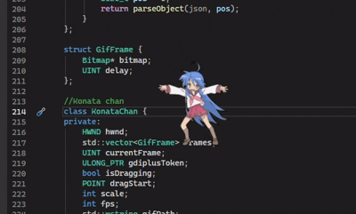

# Konata-Dancer

<a href="https://github.com/ScriptCoolestIdkSomeOne/Konata-Dancer">
  
</a>

<div align="center" style="
  background: linear-gradient(135deg, #667eea 0%, #764ba2 100%);
  border-radius: 20px;
  padding: 25px;
  margin: 20px 0;
  box-shadow: 0 10px 30px rgba(0,0,0,0.3);
  border: 1px solid rgba(255,255,255,0.2);
">
  
  <div style="margin-bottom: 10px;">
    
  </div>
  
  <h2 style="color: white; margin: 0 0 10px 0;">Konata Dancer</h2>
  
  <p style="color: rgba(255,255,255,0.9); font-size: 16px; line-height: 1.5; margin: 10px 0;">
    this is just Konata that dances cool i think 
    <span style="color: #FF69B4;">lol</span>
  </p>
  
  <div style="
    background: rgba(255,255,255,0.15);
    border-radius: 15px;
    padding: 10px;
    margin-top: 15px;
  ">
    <p style="color: white; margin: 0;">
      this is <strong>Konata Dancer</strong> and it's cool
    </p>
    <p style="color: #ddd; margin: 5px 0 0 0; font-size: 14px;">
      i will update this repo maybe
    </p>
  </div>

  <svg xmlns="http://www.w3.org/2000/svg" width="480" height="200" viewBox="0 0 480 200">
  <defs>
    <style>
      text { font-family: -apple-system, BlinkMacSystemFont, 'Segoe UI', sans-serif; }
    </style>
  </defs>
  
  <!-- bg -->
  <rect width="480" height="200" fill="#1a1a2e" rx="10"/>
  
  <!-- title -->
  <text x="50" y="30" fill="#58a6ff" font-size="14" font-weight="bold">TEST</text>
  
  <!-- img -->
 <image href="konata.ico" x="20" y="50" width="48" height="72"/>
  
  <!-- name -->
  <text x="80" y="70" fill="white" font-size="14" font-weight="bold">Lucky Star</text>
  
  <!-- ico and other shit -->
  <text x="80" y="90" fill="#888" font-size="12">
    <tspan>Anime</tspan>
  </text>
  
  <!-- date 1 -->
  <text x="160" y="90" fill="#888" font-size="12">2007</text>
  
  <!-- episodes -->
  <text x="80" y="108" fill="#888" font-size="12">24 episodes</text>
  
  <!-- status -->
  <text x="80" y="126" fill="#4CAF50" font-size="12">idk</text>
  
  <!-- date -->
  <text x="80" y="144" fill="#666" font-size="11">2007smth</text>
  
  <!-- desk -->
  <text x="80" y="165" fill="#555" font-size="11">some random shit</text>
</svg>
  
## main shit

```timotei.cpp``` is a main script and well the only script
