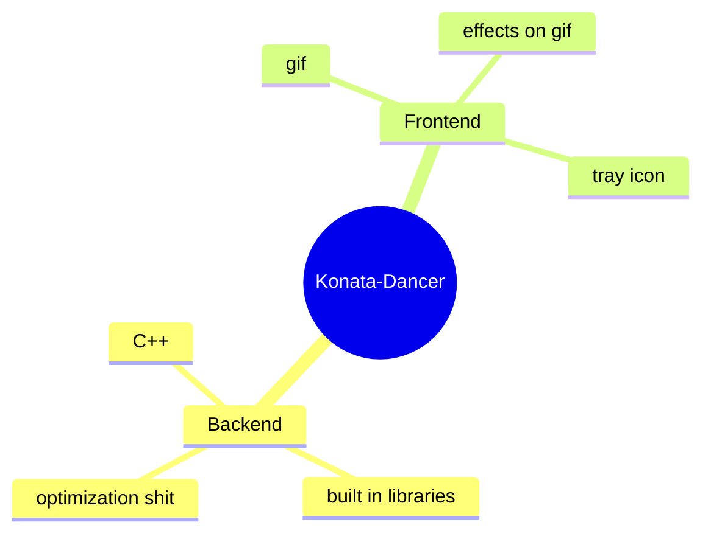

# Konata-Dancer

<a href="https://github.com/ScriptCoolestIdkSomeOne/Konata-Dancer">
  
</a>

<div align="center" style="
  background: linear-gradient(135deg, #667eea 0%, #764ba2 100%);
  border-radius: 20px;
  padding: 25px;
  margin: 20px 0;
  box-shadow: 0 10px 30px rgba(0,0,0,0.3);
  border: 1px solid rgba(255,255,255,0.2);
">
  
  <div style="margin-bottom: 10px;">
    
  </div>
  
  <h2 style="color: white; margin: 0 0 10px 0;">Konata Dancer</h2>
  
  <p style="color: rgba(255,255,255,0.9); font-size: 16px; line-height: 1.5; margin: 10px 0;">
    this is just Konata that dances cool i think 
    <span style="color: #FF69B4;">lol</span>
  </p>
  
  <div style="
    background: rgba(255,255,255,0.15);
    border-radius: 15px;
    padding: 10px;
    margin-top: 15px;
  ">
    <p style="color: white; margin: 0;">
      this is <strong>Konata Dancer</strong> and it's cool
    </p>
    <p style="color: #ddd; margin: 5px 0 0 0; font-size: 14px;">
      i will update this repo maybe
    </p>
  </div>

  

## main shit

```timotei.cpp``` is a main script and well the only script




i just copied this shit
